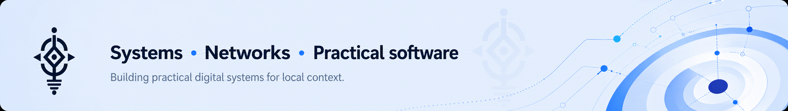
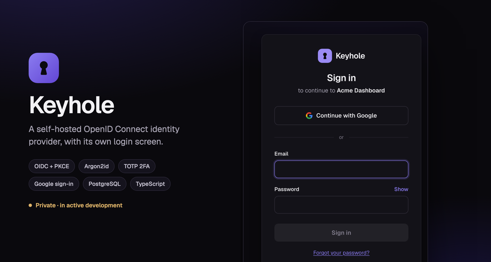
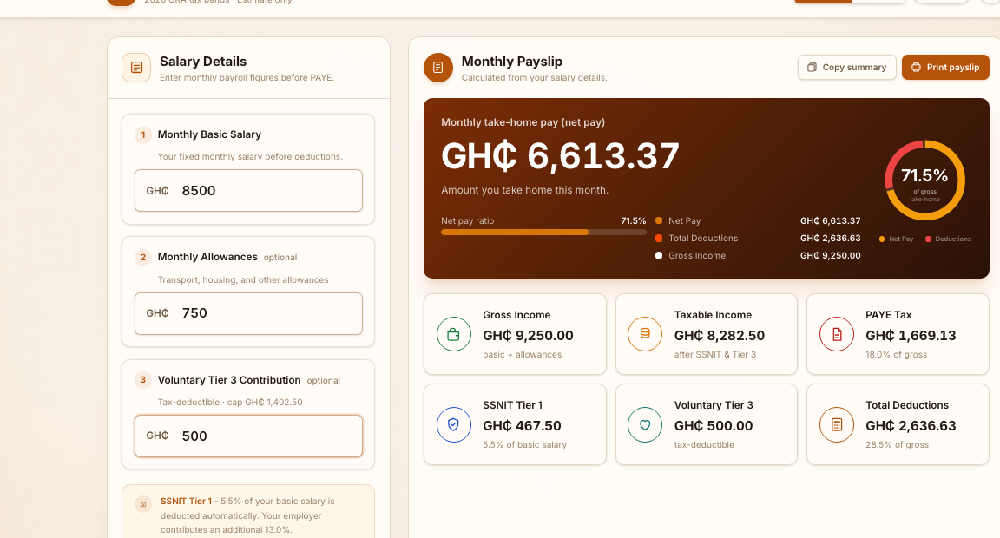
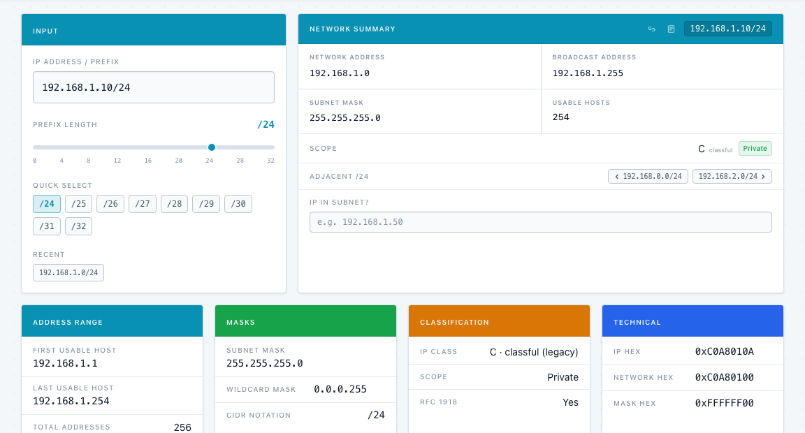
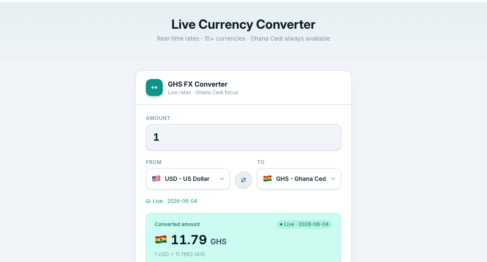
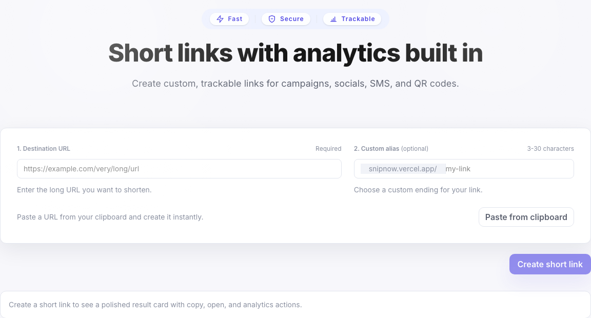

# Prince Kofi Frimpong Amissah

Most people call me **Kofi**.

**Information Systems · Networking & IT Infrastructure · Full-Stack Developer**

Accra, Ghana

## About Me

I am **Prince Kofi Frimpong Amissah**, an Information Systems graduate and CCNA-trained network technician building practical software for infrastructure, finance, and everyday Ghanaian workflows.

I like tools that make complicated things easier to trust: packet analysis, subnetting, payroll, exchange rates, escrow flows, and full-stack products that feel useful outside a tutorial.

Right now I am sharpening my work across **TypeScript**, **React**, **Next.js**, **Node.js**, **PostgreSQL/Prisma**, **Tailwind CSS**, and networking fundamentals.

## Current Focus

<table>
  <tr>
    <td width="33%">
      <strong>Ghana-focused utilities</strong> 
      PAYE, FX, payments, and tools that match local workflows.
    </td>
    <td width="33%">
      <strong>Full-stack products</strong> 
      Auth, databases, analytics, deployment, and clean UI flows.
    </td>
    <td width="33%">
      <strong>Networking & security</strong> 
      Network forensics, subnetting, IT support, and systems thinking.
    </td>
  </tr>
</table>

## Featured Projects

<table>
  <tr>
    <td colspan="2">
      
      <h3>PacketSage</h3>
      
A defensive network forensics sandbox for reviewing packet exports and decoded telemetry. It ingests Wireshark CSVs, Suricata EVE alerts, Zeek summaries, and structured logs, then reconstructs TCP/UDP flows, surfaces DNS/HTTP/TLS intelligence, flags suspicious signals with a deterministic rule engine, and drafts evidence-bound AI analyst memos through a redacting server-side proxy. Everything runs in an ephemeral in-memory sandbox and compiles into a report-ready incident timeline with a readiness score.

      

        <a href="https://packetsage.vercel.app">Live</a> ·
        <a href="https://github.com/MrrAmissah/PacketSage">Code</a>
      

      
<code>React</code> <code>TypeScript</code> <code>Vite</code> <code>Express</code> <code>Gemini</code> <code>Network Forensics</code>

    </td>
  </tr>
  <tr>
    <td colspan="2">
      
      <h3>Keyhole</h3>
      
A self-hosted OpenID Connect identity provider with its own login screen, so applications authenticate against infrastructure I run instead of a third-party auth service. Argon2id credentials, TOTP two-factor with single-use recovery codes, Google sign-in with pre-hijacking-safe account linking, step-up re-authentication, per-IP and per-account rate limiting, and revocable sessions — with an append-only audit trail behind all of it.

      
Built deliberately: the OAuth2/OIDC protocol layer is a certified library, while identity storage, credential verification, lockout, second factors, and the interface are mine. Security properties are tested adversarially — account enumeration, token replay, 2FA bypass, and orphaned sessions after account deletion each have a test asserting they fail.

      
<strong>Private repository &middot; in active development.</strong> <em>Not yet independently reviewed, so there is no public code or demo while that remains true.</em>

      
<code>TypeScript</code> <code>Node.js</code> <code>PostgreSQL</code> <code>OpenID Connect</code> <code>OAuth 2.0</code> <code>React</code> <code>Argon2id</code> <code>TOTP</code>

    </td>
  </tr>
  <tr>
    <td width="50%">
      
      <h3>FraudCase GH</h3>
      
A privacy-first, AI-assisted tool that turns scattered scam evidence (SMS, WhatsApp, links, Mobile Money receipts) into a structured case file with PII redaction, risk scoring, timelines, and PDF reports.

      

        <a href="https://fraudcase-gh.vercel.app/">Live</a> ·
        <a href="https://github.com/MrrAmissah/fraudcase-gh">Code</a>
      

      
<code>React</code> <code>TypeScript</code> <code>Express</code> <code>Firebase</code> <code>Gemini</code>

    </td>
    <td width="50%">
      
      <h3>Team Urbanflow</h3>
      
AI-powered civic-tech inspection dashboard for classifying drone gutter images, processing batches, and routing uncertain results into human review.

      

        <a href="https://urbanflow-mvp.vercel.app">Live</a> ·
        <a href="https://github.com/MrrAmissah/urbanflow-mvp">Code</a>
      

      
<code>Next.js</code> <code>TypeScript</code> <code>TensorFlow.js</code> <code>Supabase</code>

    </td>
  </tr>
  <tr>
    <td width="50%">
      
      <h3>LiveLayer</h3>
      
Local-first OBS graphics control surface for live worship and productions, with browser-based control/output, presets, local assets, people, dynamic fields, and scripture lookup.

      

        <a href="https://github.com/MrrAmissah/Live-Layer">Code</a>
      

      
<code>React</code> <code>TypeScript</code> <code>Vite</code> <code>OBS</code>

    </td>
    <td width="50%">
      
      <h3>Ghana PAYE Calculator</h3>
      
Payroll calculator for 2026 GRA bands, SSNIT Tier 1, Tier 3 relief, and printable payslips.

      

        <a href="https://ghana-paye-calculator.vercel.app/">Live</a> ·
        <a href="https://github.com/MrrAmissah/Ghana-Paye-Calculator">Code</a>
      

      
<code>React</code> <code>TypeScript</code> <code>Tailwind</code> <code>Payroll</code>

    </td>
  </tr>
  <tr>
    <td width="50%">
      
      <h3>Subnet Calculator</h3>
      
IPv4 subnet/CIDR utility with binary breakdowns and subnet splitting.

      

        <a href="https://subnet-calculator-jade.vercel.app/">Live</a> ·
        <a href="https://github.com/MrrAmissah/Subnet-Calculator">Code</a>
      

      
<code>React</code> <code>TypeScript</code> <code>Vite</code> <code>Networking</code>

    </td>
    <td width="50%">
      
      <h3>GHS FX Converter</h3>
      
Live Ghana cedi exchange rates with offline cache for quick daily checks.

      

        <a href="https://ghs-fx-converter.vercel.app">Live</a> ·
        <a href="https://github.com/MrrAmissah/GHS-FX-Converter">Code</a>
      

      
<code>React</code> <code>TypeScript</code> <code>Vite</code> <code>Live API</code>

    </td>
  </tr>
  <tr>
    <td width="50%">
      
      <h3>Snip</h3>
      
Full-stack URL shortener with persistent links and click analytics.

      

        <a href="https://snipnow.vercel.app">Live</a> ·
        <a href="https://github.com/MrrAmissah/Link-Shortener">Code</a>
      

      
<code>Next.js</code> <code>Prisma</code> <code>Neon</code> <code>Tailwind</code>

    </td>
    <td width="50%">
      
      <h3>Portfolio</h3>
      
Personal site tying together my work, skills, and contact links.

      

        <a href="https://prince-kofi-amissah.vercel.app">Live</a> ·
        <a href="./portfolio">Source</a>
      

      
<code>Next.js</code> <code>TypeScript</code> <code>Tailwind</code> <code>Framer Motion</code>

    </td>
  </tr>
  <tr>
    <td colspan="2">
      <h3>What I am building toward</h3>
      
A portfolio of tools that connects software engineering with Ghanaian business, payments, security, and infrastructure realities.

      

        <a href="mailto:princeamissah0@gmail.com">Start a conversation</a>
      

      
<code>Product Thinking</code> <code>Systems</code> <code>Delivery</code>

    </td>
  </tr>
</table>

## Toolbox

  

## GitHub Snapshot

## Contact

I am open to junior full-stack, IT support, networking, and product-building opportunities where practical systems matter.

- Portfolio: [prince-kofi-amissah.vercel.app](https://prince-kofi-amissah.vercel.app)
- LinkedIn: [linkedin.com/in/prince-kofi-frimpong-amissah](https://www.linkedin.com/in/prince-kofi-frimpong-amissah/)
- Email: [princeamissah0@gmail.com](mailto:princeamissah0@gmail.com)
- GitHub: [github.com/MrrAmissah](https://github.com/MrrAmissah)
