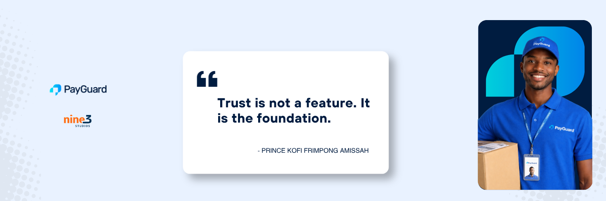
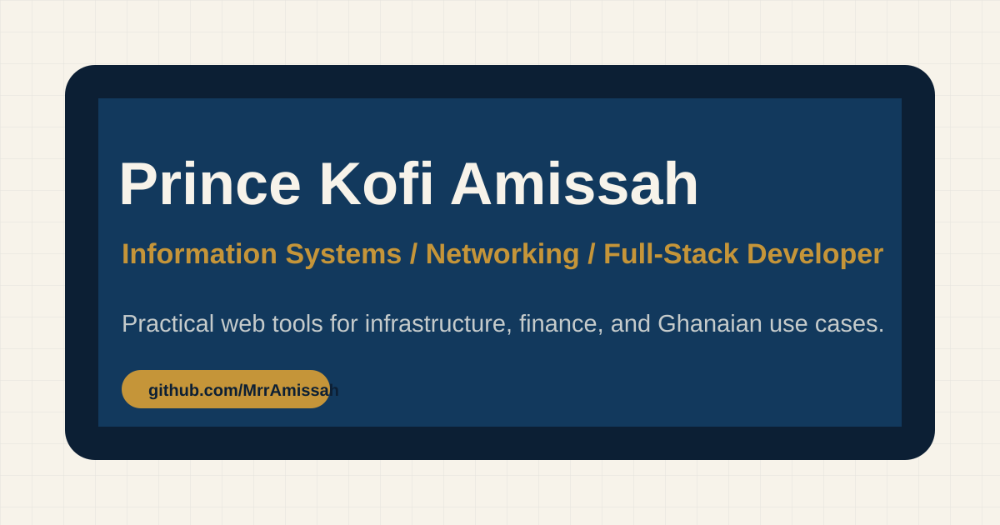
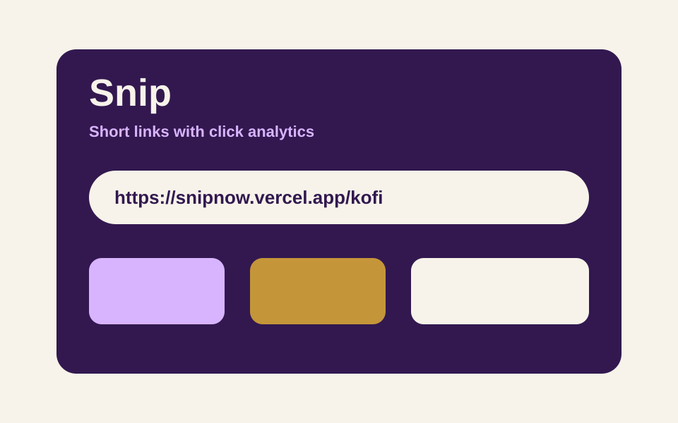
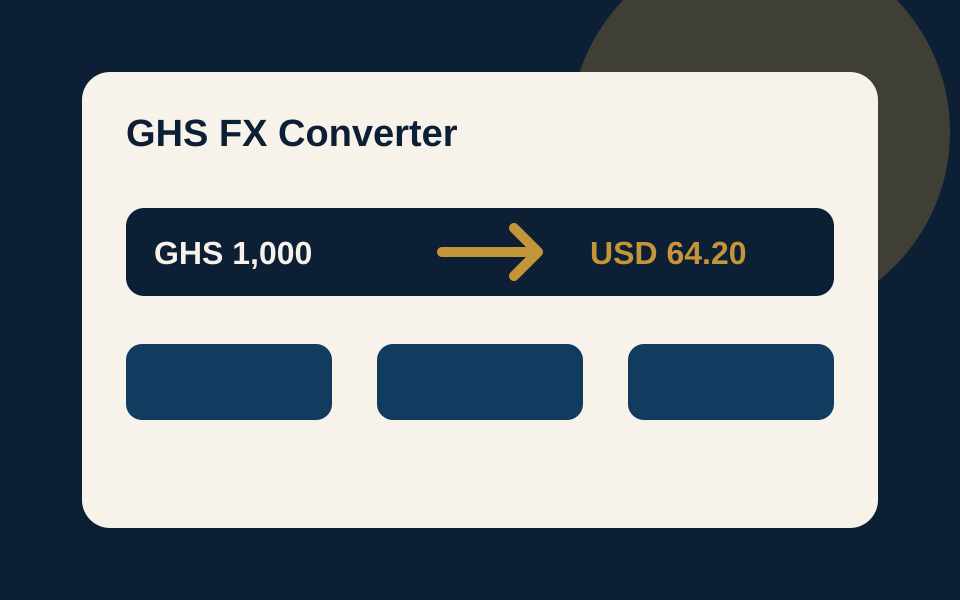
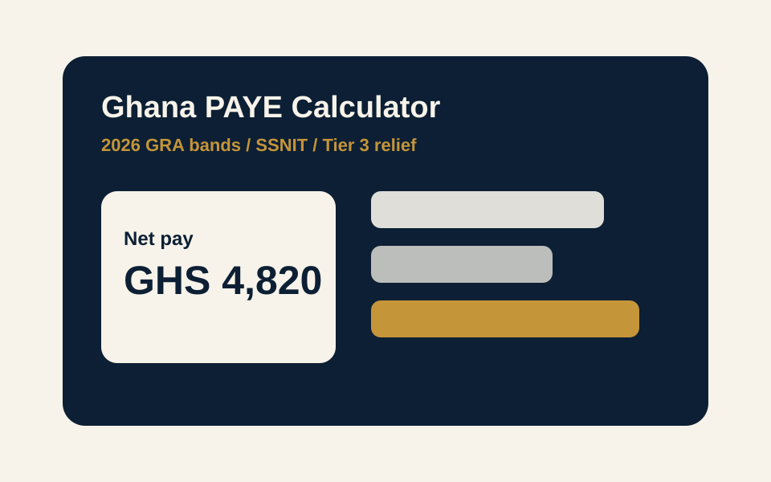
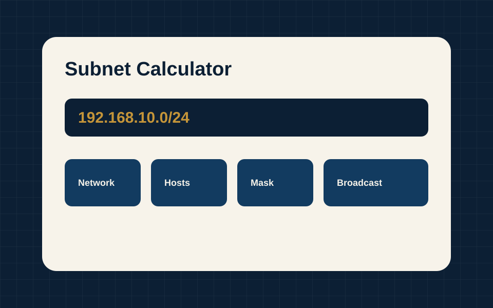

 
 

# Prince Kofi Frimpong Amissah

Most people call me **Kofi**.

**Information Systems · Networking & IT Infrastructure · Full-Stack Developer**

Accra, Ghana

## About Me

I am **Prince Kofi Frimpong Amissah**, an Information Systems graduate and CCNA-trained network technician building practical software for infrastructure, finance, and everyday Ghanaian workflows.

I like tools that make complicated things easier to trust: subnetting, payroll, exchange rates, escrow flows, and full-stack products that feel useful outside a tutorial.

Right now I am sharpening my work across **TypeScript**, **React**, **Next.js**, **Node.js**, **PostgreSQL/Prisma**, **Tailwind CSS**, and networking fundamentals.

## Current Focus

<table>
  <tr>
    <td width="33%">
      <strong>Ghana-focused utilities</strong> 
      PAYE, FX, payments, and tools that match local workflows.
    </td>
    <td width="33%">
      <strong>Full-stack products</strong> 
      Auth, databases, analytics, deployment, and clean UI flows.
    </td>
    <td width="33%">
      <strong>Networking & infrastructure</strong> 
      Subnetting, IT support, routing basics, and systems thinking.
    </td>
  </tr>
</table>

## Featured Projects

<table>
  <tr>
    <td width="50%">
      
      <h3>Portfolio</h3>
      
Personal site tying together my work, skills, and contact links.

      

        <a href="https://prince-kofi-amissah.vercel.app">Live</a> ·
        <a href="./portfolio">Source</a>
      

      
<code>Next.js</code> <code>TypeScript</code> <code>Tailwind</code> <code>Framer Motion</code>

    </td>
    <td width="50%">
      
      <h3>Snip</h3>
      
Full-stack URL shortener with persistent links and click analytics.

      

        <a href="https://snipnow.vercel.app">Live</a> ·
        <a href="https://github.com/MrrAmissah/Link-Shortener">Code</a>
      

      
<code>Next.js</code> <code>Prisma</code> <code>Neon</code> <code>Tailwind</code>

    </td>
  </tr>
  <tr>
    <td width="50%">
      
      <h3>GHS FX Converter</h3>
      
Live Ghana cedi exchange rates with offline cache for quick daily checks.

      

        <a href="https://ghs-fx-converter.vercel.app">Live</a> ·
        <a href="https://github.com/MrrAmissah/GHS-FX-Converter">Code</a>
      

      
<code>React</code> <code>TypeScript</code> <code>Vite</code> <code>Live API</code>

    </td>
    <td width="50%">
      
      <h3>Ghana PAYE Calculator</h3>
      
Payroll calculator for 2026 GRA bands, SSNIT Tier 1, Tier 3 relief, and printable payslips.

      

        <a href="https://github.com/MrrAmissah/Ghana-Paye-Calculator">Code</a>
      

      
<code>React</code> <code>TypeScript</code> <code>Tailwind</code> <code>Payroll</code>

    </td>
  </tr>
  <tr>
    <td width="50%">
      
      <h3>Subnet Calculator</h3>
      
IPv4 subnet/CIDR utility with binary breakdowns and subnet splitting.

      

        <a href="https://github.com/MrrAmissah/Subnet-Calculator">Code</a>
      

      
<code>React</code> <code>TypeScript</code> <code>Vite</code> <code>Networking</code>

    </td>
    <td width="50%">
      <h3>What I am building toward</h3>
      
A portfolio of tools that connects software engineering with Ghanaian business, payments, and infrastructure realities.

      

        <a href="mailto:princeamissah0@gmail.com">Start a conversation</a>
      

      
<code>Product Thinking</code> <code>Systems</code> <code>Delivery</code>

    </td>
  </tr>
</table>

## Toolbox

  

## GitHub Snapshot

## Contact

I am open to junior full-stack, IT support, networking, and product-building opportunities where practical systems matter.

- Portfolio: [prince-kofi-amissah.vercel.app](https://prince-kofi-amissah.vercel.app)
- Email: [princeamissah0@gmail.com](mailto:princeamissah0@gmail.com)
- GitHub: [github.com/MrrAmissah](https://github.com/MrrAmissah)
